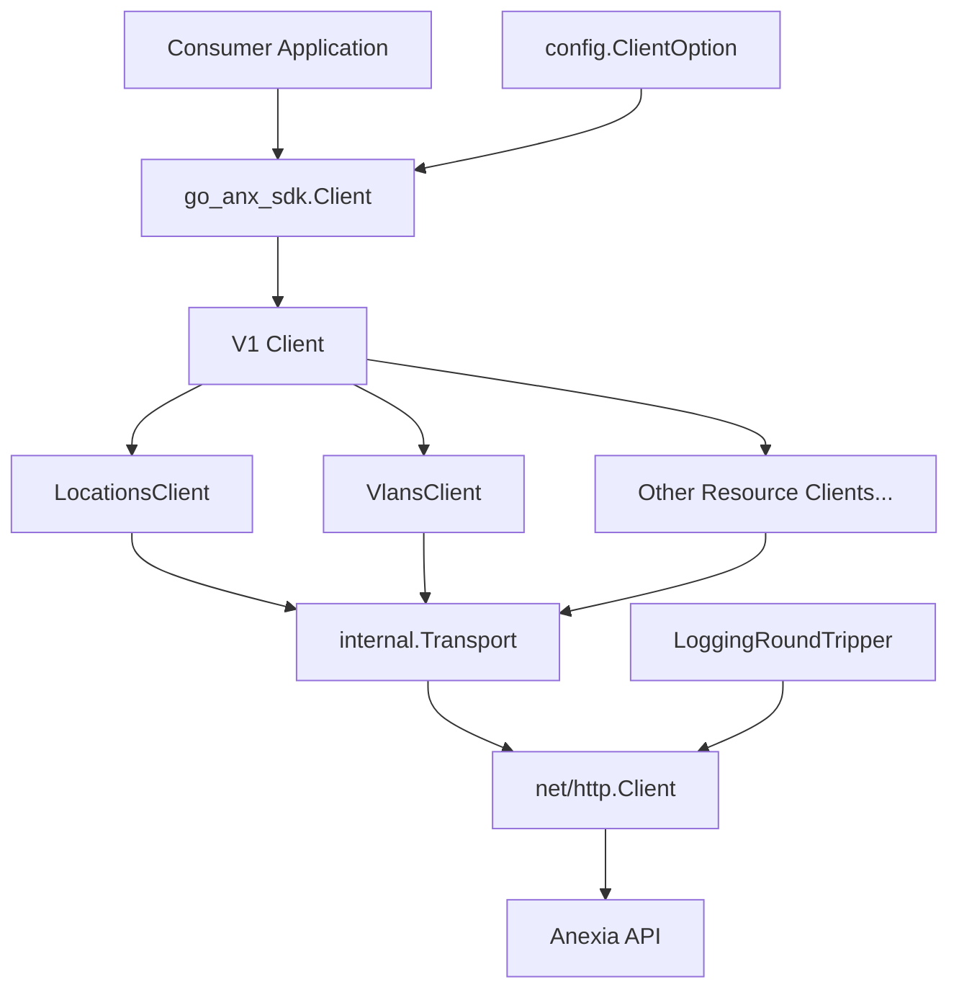
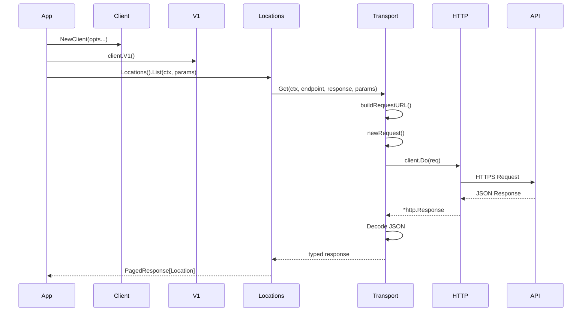

# Go Anexia API Client

A Go client for the Anexia Engine API.

This SDK provides a simple, versioned interface for interacting with Anexia resources such as locations and VLANs.

The project is still in early development.

## Installation

```bash
go get code.anexia.com/se/ks/go-anx-sdk
```

## Usage

The following shows how to use the api client.

```go
func main() {
	ctx := context.Background()

	apiKey := os.Getenv("API_KEY")

	client := go_anx_sdk.NewClient(
		config.WithAPIKey(apiKey),
		config.WithHttpClient(&http.Client{
			Transport: utils.NewLoggingRoundTripper(http.DefaultTransport),
		}),
	)

	locations, err := client.V1().Locations().List(ctx, v1.LocationListParams{})
	if err != nil {
		log.Fatal(err)
	}

	for _, l := range locations.Data {
		fmt.Printf("%+v\n", l)
	}
}
```

## API

### Versioning

All endpoints are accessed via a versioned client:

```go
// entry point to the v1 api endpoints
v1Client := client.V1()

// v1 locations api endpoints
locationV1Client := client.V1().Locations()
```

### Structure

The following diagram explains the structure of the api client and how it is used end to end.



The following diagram explains how a request flows through the different architectural layers. 



## Configuration

The client is configured using functional options:

- WithApiKey(string)
- WithBaseURL(string)
- WithHttpClient(*http.Client)

## Error handling

TBD

## Testing

    go test ./...

## License

TBD