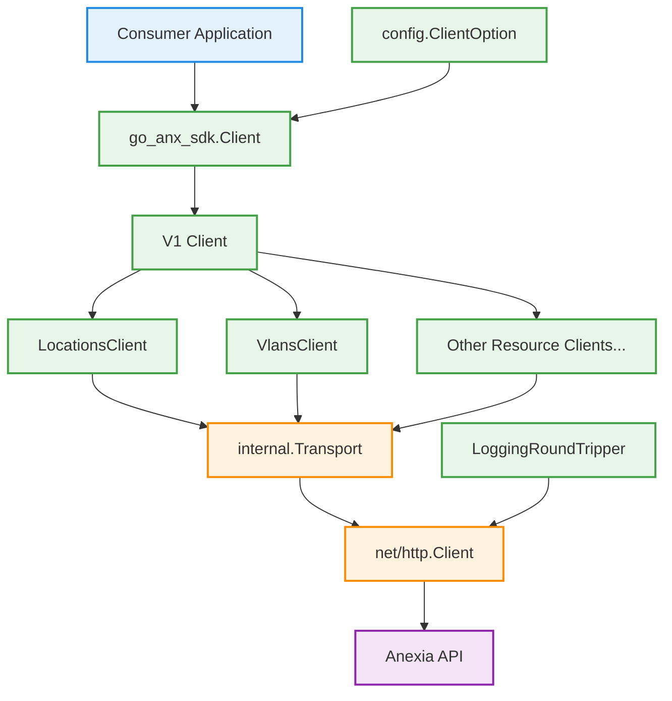
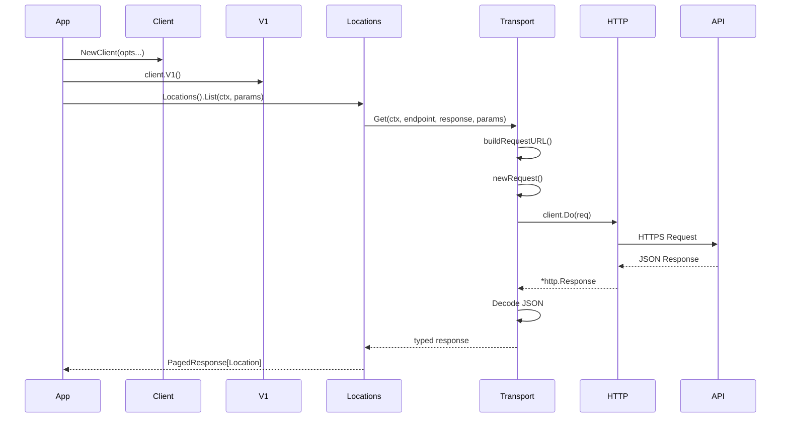

# Go Anexia API Client

A Go client for the Anexia Engine API.

This SDK provides a simple, versioned interface for interacting with Anexia resources such as locations and VLANs.

The project is still in early development.

## Installation

```bash
go get github.com/kkostial/go-anx-sdk
```

## Usage

The following shows how to use the api client.

```go
func main() {
    ctx := context.Background()

    apiKey := os.Getenv("API_KEY")

    client := go_anx_sdk.NewClient(
        config.WithAPIKey(apiKey),
        config.WithHttpClient(&http.Client{
            Transport: utils.NewLoggingRoundTripper(http.DefaultTransport),
        }),
    )

    locations, err := client.V1().Locations().List(ctx, v1.LocationListParams{})
    if err != nil {
        log.Fatal(err)
    }

    for _, l := range locations.Data {
        fmt.Printf("%+v\n", l)
    }
}
```

## API

### Versioning

All endpoints are accessed via a versioned client:

```go
// entry point to the v1 api endpoints
v1Client := client.V1()

// v1 locations api endpoints
locationV1Client := client.V1().Locations()
```

### Structure

The following diagram explains the structure of the api client and how it is used end to end.



The following diagram explains how a request flows through the different architectural layers.



## Configuration

The client is configured using functional options:

- WithApiKey(string) - required or api will return a 401
- WithBaseURL(string) - if omitted 'https://engine.anexia-it.com' will be used
- WithHttpClient(*http.Client) - if omitted the default `http.Client` will be used

## Pagination

Pagination is achieved by leveraging go's new standard library iter.Seq2 type.
The `paging.Paginate` function accepts any `paging.PageFetcher` which is provided by any client that returns paged data.

Example of iterating over all dev clusters:
```go
clusters := paging.Paginate(ctx, client.V1().DevClusters().ListPageFetcher(v1.ClusterListParams{}))
for cluster, err := range clusters {
    if err != nil {
        panic(err)
    }

    fmt.Printf("%+v\n", cluster)
}
```

To iterate over all items and fetch the details (in case the list response item is not enough) it is possible to use the `paging.PaginateAndLoad` function.
This function internally uses the `paging.Paginate` function and a provided `paginate.ItemFetcher` to load each item.

Example of iterating over all dev clusters and fetching each clusters details:

```go
clusterClient := client.V1().DevClusters()
clusters := paging.PaginateAndLoad(ctx, clusterClient.ListPageFetcher(v1.ClusterListParams{}), clusterClient.Get)
for cluster, err := range clusters {
    if err != nil {
        panic(err)
    }

    fmt.Printf("%+v\n", cluster)
}
```

## Error handling

TBD

## Testing

    go test ./...

## License

TBD